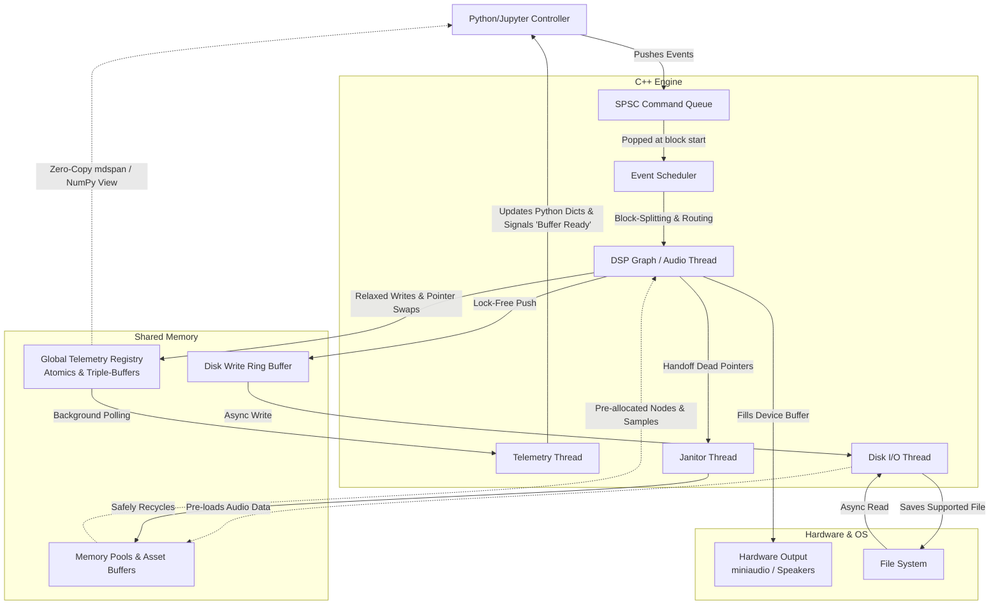
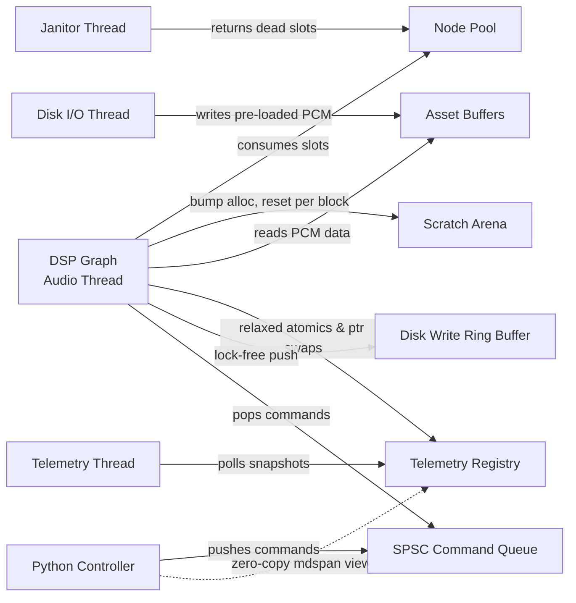
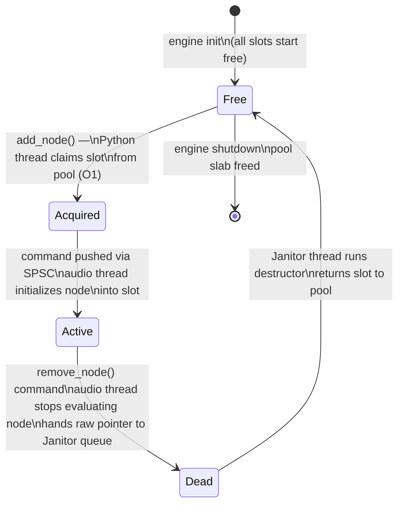
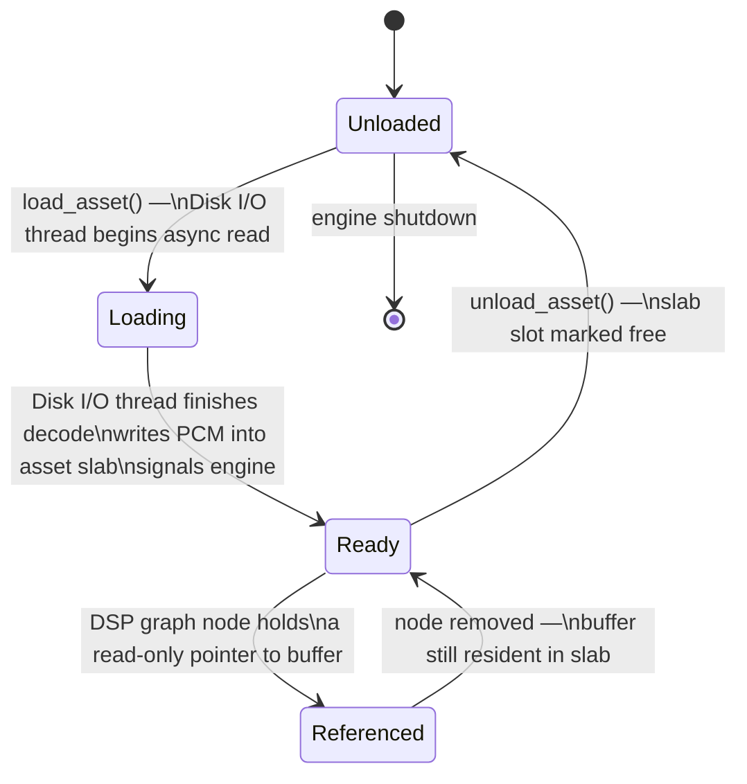
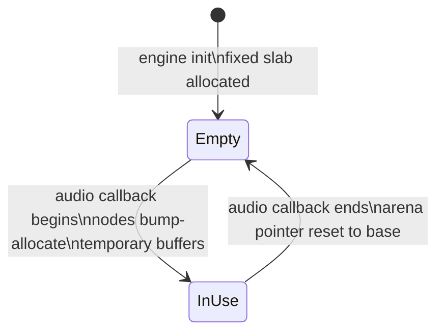
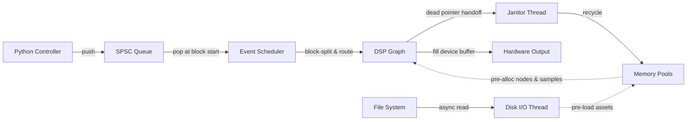
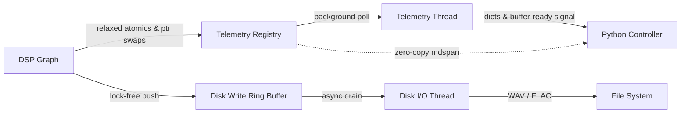

# mach: Headless Programmatic Audio Engine

## Technical Design Document

> **Status:** WIP
> **Last Updated:** <!-- date -->
> **Author:** <!-- name -->

---

## Table of Contents

1. [Introduction](#1-introduction)
   - 1.1 [Overview](#11-overview)
   - 1.2 [Core Guiding Concepts](#12-core-guiding-concepts)
2. [Problem Statement](#2-problem-statement)
3. [User Stories](#3-user-stories)
4. [Requirements](#4-requirements)
   - 4.1 [Functional Scope](#41-functional-scope)
   - 4.2 [Non-Functional Scope](#42-non-functional-scope)
5. [Out of Scope](#5-out-of-scope)
6. [System Architecture](#6-system-architecture)
   - 6.1 [High-Level Diagram](#61-high-level-diagram)
   - 6.2 [Component Breakdown](#62-component-breakdown)
   - 6.3 [Threading Model](#63-threading-model)
   - 6.4 [Memory Model](#64-memory-model)
   - 6.5 [Data Flow](#65-data-flow)
7. [Module Design](#7-module-design)
   - 7.1 [Python Controller & nanobind Bindings](#71-python-controller--nanobind-bindings)
   - 7.2 [SPSC Command Queue](#72-spsc-command-queue)
   - 7.3 [Event Scheduler](#73-event-scheduler)
   - 7.4 [DSP Graph & Audio Thread](#74-dsp-graph--audio-thread)
   - 7.5 [Telemetry System](#75-telemetry-system)
   - 7.6 [Memory Management](#76-memory-management)
   - 7.7 [Disk I/O Thread](#77-disk-io-thread)
8. [API Design](#8-api-design)
   - 8.1 [Python API](#81-python-api)
   - 8.2 [Temporal API & Scheduling](#82-temporal-api--scheduling)
   - 8.3 [Telemetry API](#83-telemetry-api)
9. [DSP Node Catalogue](#9-dsp-node-catalogue)
10. [Build System & Toolchain](#10-build-system--toolchain)
11. [Testing Strategy](#11-testing-strategy)
12. [Performance Targets & Benchmarks](#12-performance-targets--benchmarks)
13. [Known Risks & Open Questions](#13-known-risks--open-questions)
14. [Milestones](#14-milestones)
15. [Terminology](#15-terminology)
16. [References](#16-references)

---

## 1. Introduction

### 1.1 Overview

`mach` seeks to combine low-latency audio I/O and DSP processing with a simple
programmatic API for audio engineering. It aims to simplify the process of audio synthesis
and processing via a high-level Python API over a lightweight C++ audio engine, providing
a superior UX for programmatic workflows.

The project is **headless by design** — no GUI, no DAW coupling, no DSL overhead. The
interface is a Python (Jupyter-friendly) control plane over a hard real-time C++ core.

### 1.2 Core Guiding Concepts

- **The Audio Thread is Sacred:** No locks, `malloc`, or blocking I/O in the audio callback. Ever. This is the one rule that cannot be broken.
- **Pure Native Execution:** The core is implemented in C++ using `miniaudio`, prioritizing mechanical sympathy and a simplified toolchain — no transpilation, no black-boxing via DSLs like Faust.
- **Zero-Overhead Orchestration:** The Python API is a thin `nanobind` wrapper around the C++ core. Python schedules; C++ executes.
- **Sample Accuracy:** All events are scheduled to their exact intended sample. Timing is never approximate.
- **Hardware Sympathy:** Respect cache-line boundaries and target modern CPU architectures. `alignas(64)` everywhere that matters.

---

## 2. Problem Statement

Digital audio programming is currently fractured between high-level logical environments
and low-level execution. Developers face impedance mismatches across several layers:

| Ecosystem | Representative Tools | Core Problem |
|---|---|---|
| Python / Data Science | `pedalboard`, `librosa` | GIL prevents concurrency; GC is non-deterministic — unviable for real-time |
| C++ Plugin / DAW | JUCE, Tracktion | Monolithic, GUI-coupled, heavy build complexity |
| Programmatic Live Audio | Strudel (JS), TidalCycles (Haskell) | Browser/WebAudio overhead or network jitter via UDP/OSC |
| DSL Ecosystem | Faust, SuperCollider | Black-box execution or network overhead |

`mach` targets the gap: **a real-time C++ engine that is fully orchestratable from Python**,
without compromising on timing guarantees, adding network hops, or forcing use of a DSL.

---

## 3. User Stories

> **TODO:** Expand as the project and use cases evolve.

| ID | Role | Story | Acceptance Criteria |
|---|---|---|---|
| US-01 | Audio Engineer | "I want to edit audio in real-time using a general-purpose language rather than a DAW or specialized DSL, enabling agentic workflows and increased automation." | Python API can schedule, modify, and monitor a live DSP graph without audio glitches |
| US-02 | Data Scientist | "I want to analyze audio in real-time using Python, unifying data science tooling with the audio environment." | Telemetry API exposes zero-copy NumPy views of live DSP buffers |

---

## 4. Requirements

### 4.1 Functional Scope

#### DSP Node Support

| Category | Nodes |
|---|---|
| Hardware / IO | Audio Input, Audio Output, MIDI Input, MIDI Output |
| Generators | Wavetable Oscillator, Sampler, Noise Generator, VST Instrument Host |
| Channel Strip | Fader, Panner, EQ, Reverb, Delay, Compressor, Limiter, Gate, Distortion, VST Effect Host |
| Routing | Bus, Send, Return, Splitter, Sidechain Input |

#### Protocol & Format Support

- **MIDI 2.0** — sample-accurate triggering, modulation, and MPE (MIDI Polyphonic Expression)
- **VST3 Hosting** — Instruments and Effects
- **Audio Formats** — WAV, FLAC, MP3, OGG
- **Audio Backends** — WASAPI (Windows), CoreAudio (macOS), ALSA (Linux) via `miniaudio`

#### Temporal API

- Define and modify global BPM and Time Signature at runtime
- Schedule events via musical units (bars/beats), seconds, or raw samples
- Asynchronous command dispatch from Python → engine (non-blocking on both sides)

#### Telemetry

- Real-time per-node telemetry exposed back to Python
- Zero-copy NumPy / PyTorch array views via `std::mdspan`
- Signal-based notification for buffer-ready events

### 4.2 Non-Functional Scope

| Requirement | Approach |
|---|---|
| Sample accuracy | EDF scheduler sorts events by absolute sample time |
| Jitter protection | SPSC queue decouples Python clock from audio callback clock |
| Lock-free communication | SPSC queue for all controller → engine commands |
| No allocations on audio thread | Arena allocation at init; scratch arenas for DSP buffers; deferred deletion via Janitor thread |
| Python interop overhead | `nanobind` bindings; zero-copy memory views where possible |
| Hardware sympathy | `alignas(64)` on all atomic indices; thread affinity + `SCHED_FIFO` for the audio thread |

---

## 5. Out of Scope

| Item | Notes |
|---|---|
| GUI / DAW features | `mach` is headless. Raw array data is provided for external visualization. |
| Destructive editing | Non-destructive only. |
| Native waveform rendering | Out of scope, but `std::mdspan` <-> NumPy interop is a goal for external vis. |
| Legacy system support | No 32-bit, no WinMM. |
| Networking | No audio events over network. Flagged as a future goal. |

---

## 6. System Architecture

### 6.1 High-Level Diagram

### 6.2 Component Breakdown

| Component | Language | Description |
|---|---|---|
| Python Controller | Python + nanobind | High-level API. Constructs graphs, schedules events, receives telemetry. |
| SPSC Command Queue | C++ | Lock-free, bounded, single-producer single-consumer queue. Python pushes; audio thread pops at block start. |
| Event Scheduler | C++ | EDF-sorted queue of timestamped events. Handles block-splitting for sub-block accuracy. |
| DSP Graph / Audio Thread | C++ | Hard real-time DAG evaluation. Highest OS priority. Zero allocations. |
| Telemetry Thread | C++ | Background poller. Reads registry, marshals data to Python. |
| Janitor Thread | C++ | Deferred memory recycler. Receives dead pointers from DSP thread; returns to pool. |
| Disk I/O Thread | C++ | Async asset pre-loader and recorded audio writer (WAV/FLAC). |
| Global Telemetry Registry | Shared Memory | Lock-free table of atomic structs + triple-buffered array data. |
| Memory Pools & Asset Buffers | Shared Memory | Pre-allocated arenas for DSP nodes and audio sample data. |
| Disk Write Ring Buffer | Shared Memory | Lock-free ring buffer between DSP thread and Disk I/O thread. |

---

### 6.3 Threading Model

> **TODO:** CPU affinity strategy, `isolcpus` kernel param, NUMA considerations.

| Thread | Priority | Scheduling | Blocking Allowed? |
|---|---|---|---|
| DSP Graph / Audio Thread | Highest | `SCHED_FIFO` pri 99 | **Never** |
| Telemetry Thread | Below real-time | Normal | Yes |
| Janitor Thread | Below real-time | Normal | Yes |
| Disk I/O Thread | Below real-time | Normal | Yes |
| Python Main Thread | Normal | Normal | Yes |

The audio thread is pinned to a dedicated physical core isolated from OS interrupts. Telemetry and Janitor threads are pinned to helper cores so they never preempt the audio pipeline.

### 6.4 Memory Model

The cardinal rule: **the audio thread never allocates.** All memory regions are carved out at engine init before `engine.play()` is called. The audio thread only consumes from pre-allocated regions — everything else is handled by supporting threads off the hot path.

| Region | Type | Lifetime | Exhaustion Policy |
|---|---|---|---|
| Node Pool | Fixed-size object pool | Engine lifetime | Fail-fast — `add_node()` raises; pool watermark exposed via telemetry |
| Scratch Arena | Bump-allocate arena | Per-block — reset at every callback | N/A — worst-case size fixed at init |
| Asset Buffers | Variable-size slab | Asset lifetime — freed on `unload_asset()` | Fail-fast — `load_asset()` raises if insufficient space |
| Telemetry Registry | Fixed struct | Engine lifetime | N/A — statically sized at init |
| Disk Write Ring Buffer | Fixed circular buffer | Engine lifetime | Silent drop — audio thread cannot block; drop counter exposed via telemetry |
| SPSC Command Queue | Fixed circular buffer | Engine lifetime | `try_push()` returns false — Python raises immediately |

---

**Node Pool — Slot Lifecycle**

The most complex lifecycle in the system. A slot is never freed to the OS — it is only ever recycled back into the pool.

Key invariants: the audio thread never calls `new` or `delete`. It only reads the slot pointer from the pool and writes a raw pointer to the Janitor queue. The Janitor is the only thread that runs destructors. A slot in the `Dead` state is invisible to the DSP graph — the audio thread will not touch it again after the handoff.

---

**Asset Buffers — Lifecycle**

Assets are large variable-size blobs (PCM, wavetables, IR files). They live outside the node pool in a separate slab.

Key invariants: the audio thread only ever holds a read-only pointer into an asset buffer — it never writes to it and never frees it. An asset cannot be unloaded while `Referenced` — `unload_asset()` must be preceded by removing all nodes that reference it, otherwise it raises. The Disk I/O thread is the only writer.

---

**Scratch Arena — Lifecycle**

Simplest lifecycle in the system. No individual allocations are ever freed.

Key invariant: the scratch arena pointer is only ever moved forward during a block and reset at the end. No individual buffer is ever freed. Worst-case scratch usage must be known at engine init — it is `max_nodes * max_channels * block_size * sizeof(float)`.

---

**Fixed-Lifetime Regions**

The following regions are allocated once at engine init and freed once at engine shutdown. They have no intermediate lifecycle states worth tracking:

| Region | Init | Shutdown |
|---|---|---|
| Telemetry Registry | `calloc` + atomic init | freed after all threads joined |
| Disk Write Ring Buffer | `calloc` | freed after Disk I/O thread joined |
| SPSC Command Queue | `calloc` | freed after audio thread joined |

The only thing worth verifying here is **shutdown order** — threads must be joined before their backing memory is freed. Audio thread first (stop the callback), then Janitor and Disk I/O, then Telemetry, then free all regions.

### 6.5 Data Flow

**Control & Audio Path**

**Telemetry & Recording Path**

---

## 7. Module Design

### 7.1 Python Controller & nanobind Bindings

> **TODO**

### 7.2 SPSC Command Queue

> **TODO**

### 7.3 Event Scheduler

> **TODO**

### 7.4 DSP Graph & Audio Thread

> **TODO**

### 7.5 Telemetry System

> **TODO**

### 7.6 Memory Management

> **TODO**

### 7.7 Disk I/O Thread

> **TODO**

---

## 8. API Design

### 8.1 Python API

> **TODO**

### 8.2 Temporal API & Scheduling

> **TODO**

### 8.3 Telemetry API

> **TODO**

---

## 9. DSP Node Catalogue

> **TODO**

---

## 10. Build System & Toolchain

> **TODO**

---

## 11. Testing Strategy

> **TODO**

---

## 12. Performance Targets & Benchmarks

> **TODO**

---

## 13. Known Risks & Open Questions

> Living section — add to this as you build. Focus on things that could change the architecture, not implementation bugs.

### Architectural Risks

| Risk | Why It Matters |
|---|---|
| VST3 plugins allocating on the audio thread | VST3 spec does not forbid this. A misbehaving plugin breaks the one hard rule. Need a sandboxing or isolation strategy before Phase 5. |
| BPM changes mid-timeline with queued events | Events are stamped in absolute samples at schedule time. A BPM change invalidates those stamps. Do queued events get re-stamped? Does the scheduler re-sort? Needs a decision before the temporal API is built. |
| Live graph mutations mid-evaluation | `add_node()` / `remove_node()` during an active audio callback. The command arrives via SPSC but the graph topology change has to be applied atomically from the audio thread's perspective. Wrong answer here = corruption or glitch. |
| mdspan view lifetime across pointer swaps | User holds a zero-copy view reference in Python. Telemetry thread swaps the triple-buffer pointer. Is the old view now invalid? Need a clear contract on view lifetime before the telemetry API is finalized. |

### Open Decisions

| Decision | Options | Status |
|---|---|---|
| Scratch arena worst-case size | `max_nodes * max_channels * block_size * sizeof(float)` — but what are the max values? User-configured at engine init or compile-time constants? | Open |
| Telemetry polling interval | Too fast = CPU waste, too slow = Python feels unresponsive. Configurable? Hardcoded? Adaptive? | Open |
| SPSC full behavior — exact Python surface | `try_push()` returns false → Python raises immediately. What exception type? Is there a watermark warning before it hits the ceiling? | Open |
| `schedule()` with `at=` time in the past | Immediate execution? Silent drop? Raise? | Open |
| Disk Write Ring Buffer drop behavior | Silent drop decided, but should the drop counter be a telemetry atomic or a separate signal/callback to Python? | Open |

### Known Gotchas

- **Shutdown order** — audio thread must be stopped before Janitor and Disk I/O, all threads joined before any memory region is freed. Get this wrong and you get a use-after-free on shutdown.
- **`SCHED_FIFO` requires elevated privileges on Linux** — `CAP_SYS_NICE` or running as root. Document this clearly, don't silently fall back to normal scheduling without warning the user.
- **`unload_asset()` while Referenced** — a node still holds a read-only pointer into the asset slab. Must validate reference count is zero before freeing the slot, otherwise raise.
- **Stale `NodeHandle` after `remove_node()`** — Python can hold a handle to a dead node indefinitely. Any method call on a stale handle must raise `NodeNotFound`, never segfault.
- **Janitor lag** — safe by design but pool watermark must be monitored. If Janitor consistently can't keep up, pool exhaustion becomes a real risk at high node churn rates.
- **`isolcpus` not guaranteed** — thread pinning works but `isolcpus` requires a kernel boot param the user may not have set. Degrade gracefully, document the performance difference.

---

## 14. Milestones

### Phase 1 — Proof of Concept *(The "Sine Wave" Milestone)*

> Goal: prove the full vertical slice works end to end. Nothing fancy, just signal flowing from Python → C++ → speakers with no glitches.

- [ ] `miniaudio` device callback running, filling a hardware buffer
- [ ] SPSC queue implemented and wired to the audio thread
- [ ] Single `WavetableOscillator` node (sine only) allocated from a node pool
- [ ] `nanobind` wrapper — `Engine`, bare `NodeHandle`, `engine.play()` / `engine.stop()`
- [ ] Python can boot the engine and hear a tone from a Jupyter cell
- [ ] `engine.schedule(osc.set_frequency, value, time=mach.Beats(n))` works sample-accurately

**Exit criteria:** running a script in Jupyter that produces a frequency-modulated sine wave with no audio thread allocations and no glitches.

---

### Phase 2 — DSP Graph & Memory Model *(The "Graph" Milestone)*

> Goal: multiple nodes, real graph routing, full memory model in place.

- [ ] DSP DAG evaluation in topological order
- [ ] `FilterNode` (LPF/HPF) implemented
- [ ] `engine.connect()` / `engine.disconnect()` — graph mutations via SPSC
- [ ] Scratch arena wired up for per-block intermediate buffers
- [ ] Janitor thread running, node pool recycle loop proven
- [ ] Asset buffer region + `load_asset()` / `unload_asset()` path
- [ ] `SamplerNode` playing back a pre-loaded WAV file

**Exit criteria:** a multi-node graph (osc → filter → output) running live, nodes being added and removed without glitches, pool watermark staying healthy.

---

### Phase 3 — Telemetry & Python Interop *(The "Observatory" Milestone)*

> Goal: Python can see inside the engine in real-time without touching the audio thread.

- [ ] Global Telemetry Registry implemented (atomics + triple-buffers)
- [ ] Telemetry thread polling and marshalling to Python dicts
- [ ] `mdspan` → NumPy zero-copy view working for array telemetry
- [ ] `osc.telemetry.peak_amplitude`, `osc.telemetry.spectrum` accessible from Jupyter
- [ ] Explicit copy path (`snapshot()`) working alongside zero-copy view
- [ ] Drop counter on Disk Write Ring Buffer exposed via telemetry

**Exit criteria:** live matplotlib plot of spectrum data updating from a running engine in a Jupyter notebook with no audio glitches.

---

### Phase 4 — Recording & Disk I/O *(The "Recorder" Milestone)*

> Goal: capture audio to disk without touching the audio thread.

- [ ] Disk Write Ring Buffer implemented
- [ ] Disk I/O thread draining ring buffer and writing WAV
- [ ] `engine.record(path)` / `engine.stop_record()` API
- [ ] FLAC write support
- [ ] Async asset pre-load fully proven (no I/O on audio thread ever)

**Exit criteria:** a 60-second session recorded to a clean WAV file with no dropouts.

---

### Phase 5 — Full Node Catalogue & VST3 *(The "Studio" Milestone)*

> Goal: the full DSP node catalogue is implemented and VST3 plugins can be hosted.

- [ ] All channel strip nodes implemented (Reverb, Delay, Compressor, Limiter, Gate, Distortion)
- [ ] Routing nodes (Bus, Send, Return, Splitter, Sidechain)
- [ ] VST3 Instrument + Effect hosting (headless)
- [ ] MIDI 2.0 input path wired up
- [ ] Full Python node API surface with typed `NodeHandle` subclasses

**Exit criteria:** a VST3 instrument triggered via MIDI from Python, processed through a channel strip, recorded to FLAC.

---

### Future

- Networking / OSC support
- CLAP plugin hosting
- PyTorch tensor views for ML inference on audio buffers
- `isolcpus` + real-time kernel tuning guide

---

## 15. Terminology

> **TODO**

---

## 16. References

- [miniaudio documentation](https://miniaud.io/docs/)
- [nanobind documentation](https://nanobind.readthedocs.io/)
- [std::mdspan (C++23)](https://en.cppreference.com/w/cpp/container/mdspan)
- [VST3 SDK](https://steinbergmedia.github.io/vst3_doc/)
- [MIDI 2.0 Specification](https://www.midi.org/specifications/midi-2-0-specifications/)
- [Real-time audio programming 101 — Ross Bencina](http://www.rossbencina.com/code/real-time-audio-programming-101-time-waits-for-nothing)
